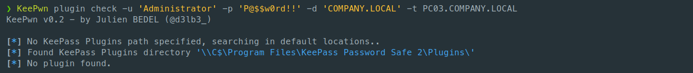
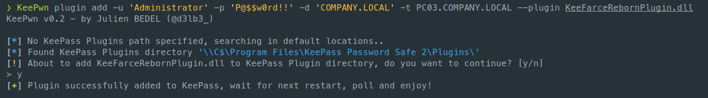
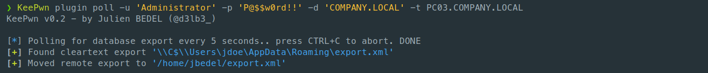
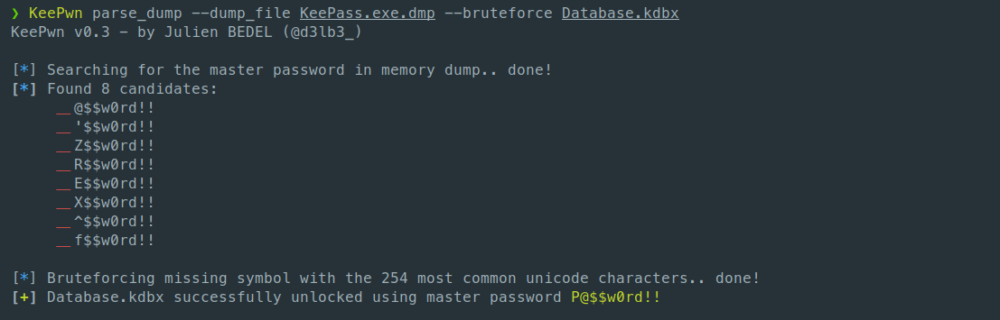
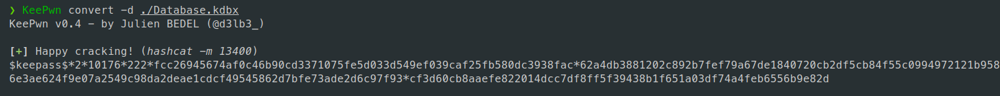
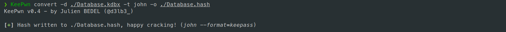

<p align="center">
  A python script to help red teamers discover KeePass instances and extract secrets.
</p>


## Features & Roadmap

>  *KeePwn is still in early development and not fully tested yet : please use it with caution and always try it in a lab before (legally) attacking real-life targets!*

- [x] KeePass Discovery
  - [x] Accept multiple target sources (IP, range, hostname, file)
  - [x] Automatically look for KeePass global installation files via SMB C$ share.
  - [x] Automatically look for KeePass portable via SMB C$ share.
  - [ ] Automatically check for running KeePass process through Impacket-based command execution.
  - [x] Multi-thread implementation to avoid bottleneck hosts.
  - [x] Automatically check for KeePass binary's metadata (version, last access time).
- [x] KeePass Plugin Abuse
  - [x] Automatically upload a plugin (DLL or PFX format) to extract passwords, see [KeeFarce Reborn](https://github.com/d3lb3/KeeFarceReborn).
  - [x] Automatically poll for cleartext exports on the remote host.
- [x] KeePass Trigger Abuse
  - [x] Add and remove triggers from KeePass configuration file via SMB C$ share.
  - [x] Automatically poll for cleartext exports on the remote host.
  - [ ] Customize triggers with command line arguments.
- [x] KeePass Dump Parsing (CVE-2023-32784)
  - [x] Parse memory dumps to find master password candidates.
  - [x] Bruteforce missing characters with the most common unicode characters.
- [x] KeePass Database Cracking
  - [x] Convert KDBX to John and Hashcat compatible formats.
  - [ ] Add support for [KDBX 4.x format](https://palant.info/2023/03/29/documenting-keepass-kdbx4-file-format).
- [x] Authentication
  - [x] Support LM/NT hash authentication.
  - [ ] Support Kerberos Authentication.
- [ ] Miscellaneous
  - [ ] Write unit tests.
  - [ ] Make the project available on [PyPI](https://pypi.org/) .

## Installation

```
git clone https://github.com/Orange-Cyberdefense/KeePwn
cd KeePwn
sudo python3 setup.py install
KeePwn --help
```

Or if you don't want to install but just run :

```
git clone https://github.com/Orange-Cyberdefense/KeePwn
cd KeePwn
python3 -m pip install -r requirements.txt
python3 KeePwn.py --help
```

## Usage

<details><summary><b>Discovery</b></summary>

KeePwn's `search` module is used to identify hosts that run KeePass on your target environment.


It makes use of the built-in C$ share to look for KeePass-related files in default locations, hence requiring administrator privileges on the targets.

Note that for the moment, it only searches for the global KeePass.exe binary (in Program Files) and the local KeePass.config.xml (in %APPDATA%). Future release should include KeePass local installation paths (for example: on a user's Dekstop) as well as Windows Store installation.

</details>
<details><summary><b>Plugin Abuse</b></summary>

KeePass features a [plugin framework](https://keepass.info/help/v2/plugins.html) which can be abused to load malicious DLLs into KeePass process, allowing attackers with administrator rights to easily export the database (see: [KeeFarceRebornPlugin](https://github.com/d3lb3/KeeFarceReborn#make-keepass-inject-keefarce-reborn-as-a-plugin)).

KeePwn's `plugin` module allows to :

- List currently installed plugins

  

- Add and remove your malicious plugins

  

- Poll %APPDATA% for exports and automatically moves it from remote host to local filesystem

  

These actions are made through SMB C$ share access, limiting AV/EDR detection as no command execution is performed.

</details>
<details><summary><b>Trigger Abuse</b></summary>

As described in [@harmj0y's blog post](https://blog.harmj0y.net/redteaming/keethief-a-case-study-in-attacking-keepass-part-2/) (and later CVE-2023-24055), KeePass trigger system can be abused in order to export the database in cleartext.

KeePwn's `trigger` module allows to :

- Check if a malicious trigger named "export" is currently written in KeePass configuration

  

- Add and remove a malicious trigger named "export" which performs a cleartext export of the database in %APPDATA% on next KeePass launch

  

- Poll %APPDATA% for exports and automatically moves it from remote host to local filesystem

  

If the configuration file path is not the default location, you can specify one with `--config-path` argument.

</details>
<details><summary><b>Memory Dumps Parsing</b></summary>

As described by [@vdohney](https://github.com/vdohney/keepass-password-dumper), it is possible to retrieve the database's master password in memory (CVE-2023-32784, affecting versions prior to KeePass 2.54). 

KeePwn `parse_dump` module will search for potential master password candidates in dumps. Because the resulting strings will (by design) be incomplete, the module can also be used to bruteforce the missing first character against a specified KDBX file.



The memory dump parsing makes use of [@CMEPW's Python PoC](https://github.com/CMEPW/keepass-dump-masterkey). Thanks for letting me re-use the code :)

</details>
<details><summary><b>Cracking KDBX Databases</b></summary>

keepass2john.py script by [@harmjoy](https://github.com/HarmJ0y) was ported to KeePwn with the help of [@0xSp3ctra](https://github.com/0xSp3ctra).

KeePwn `convert` will extract a crackable hash (john or hashcat format) from a KeePass Database. 



It can be used with more arguments to specify the expected hash type as well as an output file path:



KDBX 4.x is not yet supported, you may use https://github.com/r3nt0n/keepass4brute. 
If you are in the mood for a PR https://palant.info/2023/03/29/documenting-keepass-kdbx4-file-format should be a good read :)

## Contribute

Pull requests are welcome (see: Roadpmap + TODO in code).

Feel free to open an issue or DM me on Twitter to suggest improvement.
