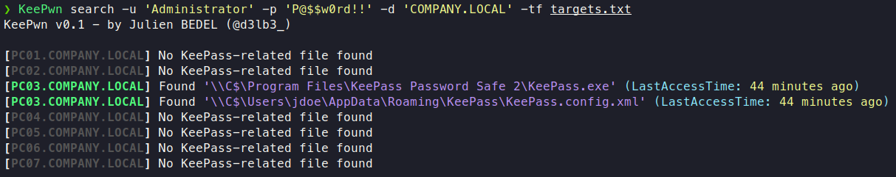
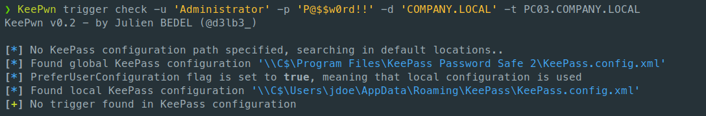
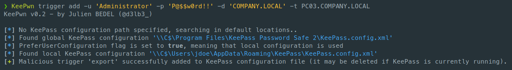
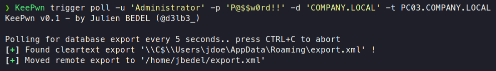

<p align="center">
  A python script to help red teamers discover KeePass instances and extract secrets.
</p>


## Features & Roadmap

>  *KeePwn is still in early development and not fully tested yet : please use it with caution and always try it in a lab before (legally) attacking real-life targets!*

- [x] KeePass Discovery
  - [x] Accept multiple target sources (IP, range, hostname, file)
  - [x] Automatically look for KeePass global installation files via SMB C$ share.
  - [ ] Automatically look for KeePass portable + Windows store installation files via SMB C$ share.
  - [ ] Automatically check for running KeePass process through Impacket-based command execution.
  - [ ] Multi-thread implementation to avoid bottleneck hosts.
- [x] KeePass Trigger Abuse
  - [x] Add and remove triggers from KeePass configuration file via SMB C$ share.
  - [x] Automatically poll for cleartext exports on the remote host.
  - [ ] Customize triggers with command line arguments.
- [ ] KeePass Cracking
  - [ ] Convert KDBX to John and Hashcat compatible formats (including KDBX 4).
- [ ] KeePass Plugin Abuse
  - [ ] Automatically upload a plugin (DLL or PFX format) to extract passwords, see [KeeFarce Reborn](https://github.com/d3lb3/KeeFarceReborn).
  - [ ] Automatically poll for cleartext exports on the remote host.
- [x] Authentication
  - [x] Support LM/NT hash authentication.
  - [ ] Support Kerberos Authentication.
- [ ] Miscellaneous
  - [ ] Write unit tests.
  - [ ] Make the project available on [PyPI](https://pypi.org/) 


## Installation

```
git clone https://github.com/Orange-Cyberdefense/KeePwn
cd KeePwn
sudo python3 setup.py install
KeePwn --help
```

Or if you don't want to install but just run :

```
git clone https://github.com/Orange-Cyberdefense/KeePwn
cd KeePwn
python3 -m pip install -r requirements.txt
python3 KeePwn.py --help
```

## Usage

### Search Mode

The `search` module is used to identify hosts that run KeePass on your target environment. It makes use of the built-in C$ share to look for default KeePass-related files locations. For the moment, it only searches for global KeePass.exe binary (in *Program Files*) and local KeePass.config.xml (in *%APPDATA%*).

While enumerating KeePass through SMB shares is quieter against antiviruses protections, it sometimes lack some information like "is KeePass currently being run ?" (useful if you want to extract secrets through DLL injection with [KeeFarceReborn](https://github.com/d3lb3/KeeFarceReborn)). I will soon implement the `--search-process` flag that will check for live KeePass process execution through Impacket-based remote command execution.

### Trigger Mode

As described in @harmj0y's [blog post (*Exfiltration Without Malware* part)](https://blog.harmj0y.net/redteaming/keethief-a-case-study-in-attacking-keepass-part-2/), KeePass trigger system can be abused in order to export the database in cleartext. KeePwn trigger modules allows to :

- Check if a malicious trigger named "export" is currently present in KeePass configuration.

  

- Add and remove a malicious trigger named "export" which performs a cleartext export of the database in %APPDATA% on next KeePass launch.

  

- Poll %APPDATA% for exports and automatically moves it from remote host to local.

  

Once again, these actions are made through SMB C$ share access, limiting antiviral detection as no command execution is performed.

If no configuration file path is specified, note that KeePwn will try to find it manually by looking in default locations. As KeePass trigger manipulation should always be added with caution, the mode is limited to 1 host and 1 configuration file at a time. Feel free to let me know if you think of a use case that would need more than that (massive trigger abuse on a whole network?). 

## Contribute

Pull requests are welcome (see: Roadpmap + TODO in code).

Feel free to open an issue or DM me on Twitter to suggest improvement.